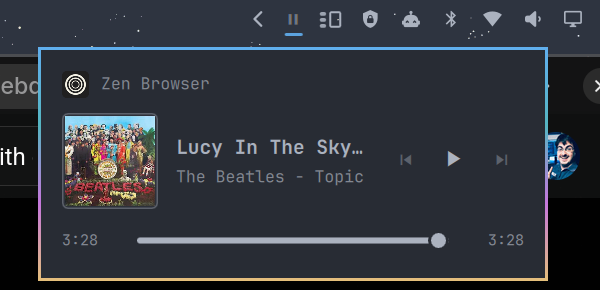

# Media Control for Omarchy

A GNOME-style now-playing widget for the [Omarchy](https://omarchy.org) bar.

A single play/pause glyph appears in the bar only while media is playing. Click it and a panel slides out with the app that is playing, the cover art, track details, transport controls and a seek bar — very much like the media section in GNOME's quick settings.



## Features

- **Unobtrusive indicator** – a ▶ / ⏸ glyph that shows up only when a player has a track loaded and disappears when nothing is playing. Optionally hide it while paused.
- **GNOME-style panel** – app icon and name, cover art, title / artist / album, ⏮ ⏯ ⏭ controls.
- **Seek bar** – elapsed and total time, draggable when the player supports seeking (shown only when the player reports a track length).
- **Multiple players** – when more than one MPRIS source is active (browser + Spotify, say) the panel lists them and lets you switch the active one.
- **Quick actions on the indicator** – right click toggles play/pause, middle click skips to the next track, the mouse wheel goes to previous/next.
- **IPC surface** – bind keys or script it: `omarchy-shell debba.media-control toggle|open|close|playPause|next|previous`.
- **Native look** – built with Omarchy's own UI components, so it follows your theme, bar position and font.

Works with anything that speaks MPRIS: Firefox / Zen / Chromium tabs, Spotify, mpv (with `mpv-mpris`), VLC, Rhythmbox, and so on. Under the hood it reuses Omarchy's built-in `omarchy.media` service, so media keys and the OSD stay in sync.

## Requirements

- Omarchy 4.x (Quickshell-based shell)

## Install

```bash
git clone https://github.com/debba/omarchy-media-control ~/Projects/omarchy-media-control
~/Projects/omarchy-media-control/install.sh
```

The installer symlinks the repository into `~/.config/omarchy/plugins/debba.media-control` and enables the widget in the right section of the bar. Pass a section name to put it elsewhere:

```bash
~/Projects/omarchy-media-control/install.sh center
```

Because the plugin is a symlink, `git pull` is all it takes to update.

If you had Omarchy's stock `omarchy.media` widget on the bar you may want to remove it to avoid two indicators:

```bash
omarchy plugin disable omarchy.media
```

## Usage

| Action                          | Result                         |
|---------------------------------|--------------------------------|
| Left click on the indicator     | Open / close the panel         |
| Right click                     | Play / pause                   |
| Middle click                    | Next track                     |
| Mouse wheel up / down           | Previous / next track          |
| Drag the seek bar               | Seek (if the player allows it) |
| Click a source in the list      | Make that player the active one |

### Keyboard shortcut

Add to `~/.config/hypr/bindings.lua`:

```lua
o.bind("SUPER + M", "Media panel", "omarchy-shell debba.media-control toggle")
```

## Settings

Change them with `omarchy bar set` or directly in `~/.config/omarchy/shell.json`:

```bash
omarchy bar set debba.media-control hideWhenPaused true
omarchy bar set debba.media-control panelWidth 380
```

| Key              | Type    | Default | Description                                                        |
|------------------|---------|---------|--------------------------------------------------------------------|
| `hideWhenPaused` | boolean | `false` | Hide the indicator while playback is paused (it stays while the panel is open) |
| `panelWidth`     | number  | `340`   | Width of the panel in pixels                                        |

## Uninstall

```bash
~/Projects/omarchy-media-control/uninstall.sh
```

## Notes

- Browsers only expose a track length for some sites, so the seek bar may not appear for every tab.
- `mpv-mpris` registers two bus names for a single mpv instance, so mpv shows up twice in the source list. That is an mpv quirk, not a bug in the widget.

## License

MIT — see [LICENSE](LICENSE).
